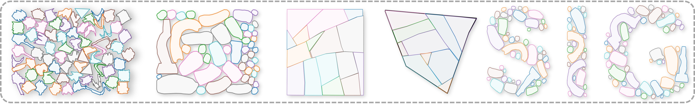

# GFPack++: Attention-Driven Gradient Fields for Optimizing 2D Irregular Packing

> Published at ICCV 2025, International Conference on Computer Vision.



## Authors

Tianyang Xue<sup>1</sup>, Lin Lu<sup>1</sup>*, Yang Liu<sup>2</sup>, Mingdong Wu<sup>3</sup>, Hao Dong<sup>3</sup>, Yanbin Zhang<sup>1</sup>, Renmin Han<sup>1</sup>, Baoquan Chen<sup>3</sup>  
<sup>1</sup>Shandong University, <sup>2</sup>Microsoft Research Asia, <sup>3</sup>Peking University


## Abstract

2D irregular packing is a classic combinatorial optimization problem with various applications, such as material utilization and texture atlas generation. Due to its NP-hard nature, conventional numerical approaches typically encounter slow convergence and high computational costs. Previous research (GFPack) introduced a generative method for gradient-based packing, providing early evidence of its feasibility but faced limitations such as insufficient rotation support, poor boundary adaptability, and high overlap ratios. In this paper, we propose **GFPack++**, a deeply investigated framework that adopts attention-based geometry and relation encoding, enabling more comprehensive modeling of complex packing relationships. We further design a constrained gradient and a weighting function to enhance both the feasibility of the produced solutions and the learning effectiveness. Experimental results on multiple datasets demonstrate that GFPack++ achieves higher space utilization, supports continuous rotation, generalizes well to arbitrary boundaries, and infers orders of magnitude faster than previous approaches.

This repository accompanies the ICCV 2025 paper **GFPack++: Attention-Driven Gradient Fields for Optimizing 2D Irregular Packing**. The code base provides training, evaluation, and sampling utilities for our attention-enhanced score model that learns packing gradients directly from teacher demonstrations.
The repository is organised so the Python sources live under `src/`, shell entry-points under `scripts/`, and binary extensions / datasets under dedicated folders.  
The current release merges the collision potential field and gap-removal enhancement so both operate together during sampling.  In our experiments this behaves comparably to the original implementation where the collision field is applied separately from the inference update, while being more efficient because the fused formulation reuses the same intermediate computations.

## Directory Layout

```
.
├── checkpoints/           # Pretrained weights and archived snapshots
├── data/
│   ├── datasets/          # Training / validation .pkl files
│   ├── polygons/          # Polygon definitions (0.txt …)
│   └── gfpack.zip         # Optional compressed resources
├── environment.yml        # Conda environment specification
├── external/
│   └── rmspacing_cpp/     # Native extensions (build scripts + sources)
├── logs/                  # TensorBoard logs written during runs
├── scripts/               # Helper shell / utility scripts
└── src/                   # Python package (`python -m src.train`, etc.)
```

Key Python modules:

| File | Purpose |
| --- | --- |
| `src/score_model.py` | Transformer-based score model |
| `src/gnn_feature.py` | Polygon GNN feature extractor |
| `src/geometry_utils.py` | Polygon grid utilities + RNG seeding helper |
| `src/sde.py` | SDE definitions and samplers |
| `src/train.py` | Distributed training entry-point |
| `src/evaluate.py` | Evaluation / inference script |

## 1. Setup

```bash
conda env create -f environment.yml
conda activate gfpack
```

All scripts and Python entry-points assume the `gfpack` environment is active.

## 2. Build the Native Extensions

The model relies on two pybind11 extensions: `calutil` and `rmspacing`.  They
must be compiled on the target machine before training or evaluation.  The
`rmspacing` module enforces workspace bounds (`width`/`height`) while resolving
overlaps, so keep those parameters aligned with your dataset scale.

```bash
cd external/rmspacing_cpp
bash build_util.sh   # builds calutil*.so
bash build.sh        # builds rmspacing*.so
```

Copy the resulting shared objects into `src/` (overwrite the placeholders if
you rebuilt them):

```bash
cp calutil*.so rmspacing*.so ../../src/
```

## 3. Data Preparation

- Place training datasets (e.g. `dataset_train.pkl`) inside
  `data/datasets/`.  The validation set
  `dataset_vali.pkl` is already staged there.
- Polygon definitions (`0.txt` …) live directly inside `data/polygons/`.  If you
  have an archive, extract it so every file is available at:
  `data/polygons/<poly_id>.txt`.

## 4. Training

`scripts/train.sh` wraps `torchrun` and always executes from the project root.
It loads the latest checkpoint from `checkpoints/score_model.pth` when present.

```bash
conda activate gfpack
./scripts/train.sh --log_dir run_001 --batch_size 512
```

Outputs:
- TensorBoard logs → `logs/run_001/train/**`
- Latest weights → `checkpoints/score_model.pth` (and a pickle copy)
- Snapshot per `vali_freq` epochs → `checkpoints/snapshots/score_model_epoch*.pth`

All standard `argparse` flags from `src/train.py` can be forwarded through the
shell script.

## 5. Evaluation / Sampling

`scripts/eval.sh` launches the evaluation pipeline (single GPU by default) and
expects the trained checkpoint in `checkpoints/score_model.pth`.

```bash
conda activate gfpack
./scripts/eval.sh --log_dir eval_run
```

Results, including rendered polygon placements, will be written to the same
logging hierarchy (`logs/eval_run/eval/**`).  Open TensorBoard to inspect the
metrics and figures:

```bash
tensorboard --logdir logs
```

## 6. Questions / Contributions

Issues and pull requests are welcome.  If you hit a build or runtime problem,
provide:

1. The exact command you executed (`scripts/train.sh …`)
2. Conda / CUDA versions
3. A brief excerpt of the console or TensorBoard output

That information will make it much easier to help.

## Citation

If you find this project useful, please cite our ICCV 2025 paper:

```bibtex
@inproceedings{Xue2025GFPackPP,
  title     = {GFPack++: Attention-Driven Gradient Fields for Optimizing 2D Irregular Packing},
  author    = {Tianyang Xue and Lin Lu and Yang Liu and Mingdong Wu and Hao Dong and Yanbin Zhang and Renmin Han and Baoquan Chen},
  booktitle = {Proceedings of the IEEE/CVF International Conference on Computer Vision (ICCV)},
  year      = {2025}
}
```
